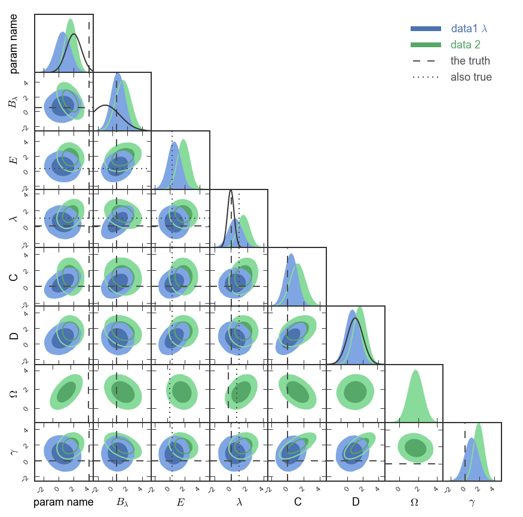

pygtc.py
=========

**What is a Giant Triangle Confusogram?**

A Giant-Triangle-Confusogram (GTC, aka triangle plot) is a way of
displaying the results of a Monte-Carlo Markov Chain (MCMC) sampling or similar
analysis. (For a discussion of MCMC analysis, see the excellent ``emcee``
package.) The recovered parameter constraints are displayed on a grid in which
the diagonal shows the one-dimensional posteriors (and, optionally, priors) and
the lower-left triangle shows the pairwise projections. You might want to look
at a plot like this if you are fitting a model to data and want to see the
parameter covariances along with the priors.

Here's an example of a GTC with some random data and arbitrary labels::

  pygtc.plotGTC(chains=[samples1,samples2],
                paramNames=names,
                chainLabels=chainLabels,
                truths=truths,
                truthLabels=truthLabels,
                priors=priors,
                paramRanges=paramRanges,
                figureSize='MNRAS_page')

**But doesn't this already exist in corner.py, distUtils, etc...?**

Although several other packages exists to make such a plot, we were unsatisfied
with the amount of extra work required to massage the result into something we
were happy to publish. With ``pygtc``, we hope to take that extra legwork out of
the equation by providing a package that gives a figure that is publication
ready on the first try! You should try all the packages and use the one you like
most; for us, that is ``pygtc``!

Installation
------------
For a quick start, you can just use ``pip``. It will install the required
dependencies for you (``numpy`` and ``matplotlib``)::

  pip install pygtc

For more installation details, see the `documentation <http://pygtc.readthedocs.io/>`_.

Documentation
-------------
Documentation is hosted at `ReadTheDocs <http://pygtc.readthedocs.io/>`_,
or check out `demo.ipynp <https://github.com/SebastianBocquet/pygtc/blob/master/demo.ipynb>`_,
in this repository, for a working example.

To build your own local copy of the documentation you'll need to install sphinx. Then you can run ``make html`` from within the ``docs`` folder.

Citation
--------
If you use pygtc to generate plots for a publication, please cite as::

  @article{Bocquet2016,
    doi = {10.21105/joss.00046},
    url = {http://dx.doi.org/10.21105/joss.00046},
    year  = {2016},
    month = {oct},
    publisher = {The Open Journal},
    volume = {1},
    number = {6},
    author = {Sebastian Bocquet and Faustin W. Carter},
    title = {pygtc: beautiful parameter covariance plots (aka. Giant Triangle Confusograms)},
    journal = {The Journal of Open Source Software}
  }

Copyright 2016, Sebastian Bocquet and Faustin W. Carter

.. image:: https://zenodo.org/badge/DOI/10.5281/zenodo.159091.svg
   :target: https://doi.org/10.5281/zenodo.159091
