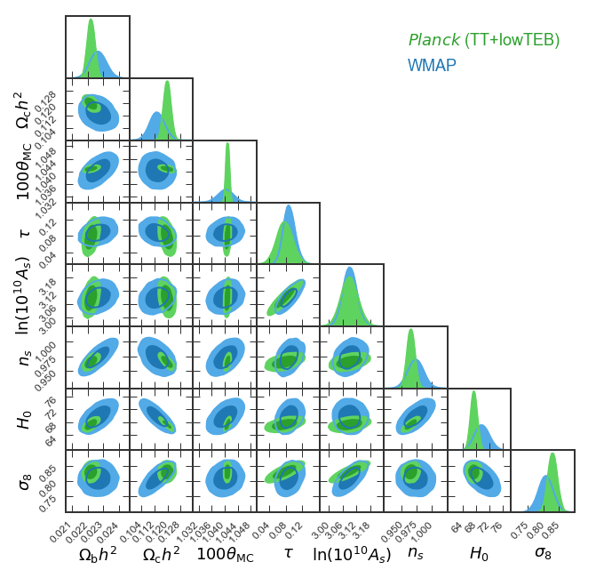

Example 2: Making a GTC/triangle plot with Planck and WMAP data!
================================================================

Download the data
-----------------

The full set of chains from the Planck 2015 release is available at
http://pla.esac.esa.int/pla/#cosmology. You will want to download
``COM_CosmoParams_fullGrid_R2.00.tar.gz``. Careful, that's a huge file
to download (3.6 GB)!

Extract everything into a directory, cd into that directory, and run
this notebook.

.. code:: ipython3

    %matplotlib inline
    %config InlineBackend.figure_format = 'retina' # For mac users with Retina display
    
    import numpy as np
    from matplotlib import pyplot as plt
    import pygtc

Read in and format the data
---------------------------

.. code:: ipython3

    WMAP, Planck = [],[]
    for i in range(1,5):
        WMAP.append(np.loadtxt('./base/WMAP/base_WMAP_'+str(i)+'.txt'))
        Planck.append(np.loadtxt('./base/plikHM_TT_lowTEB/base_plikHM_TT_lowTEB_'+str(i)+'.txt'))

.. code:: ipython3

    # Copy all four chains into a single array
    WMAPall = np.concatenate((WMAP[0],WMAP[1],WMAP[2],WMAP[3]))
    Planckall = np.concatenate((Planck[0],Planck[1],Planck[2],Planck[3]))

Select the parameters and make labels
-------------------------------------

In the chain directories, there are ``.paramnames`` files that allow you
to find the parameters you are interested in.

.. code:: ipython3

    WMAPplot = WMAPall[:,[2,3,4,5,6,7,9,15]]
    Planckplot = Planckall[:,[2,3,4,5,6,7,23,29]]

.. code:: ipython3

    # Labels, pyGTC supports Tex enclosed in $..$
    params = ('$\Omega_\mathrm{b}h^2$',
              '$\Omega_\mathrm{c}h^2$',
              '$100\\theta_\mathrm{MC}$',
              '$\\tau$',
              '$\ln(10^{10}A_s)$',
              '$n_s$','$H_0$',
              '$\\sigma_8$')
    
    chainLabels = ('$Planck$ (TT+lowTEB)','WMAP')

Make the GTC!
-------------

Produce the plot and save it as ``Planck-vs-WMAP.pdf``.

.. code:: ipython3

    GTC = pygtc.plotGTC(chains=[Planckplot,WMAPplot],
                        weights=[Planckall[:,0],
                        WMAPall[:,0]],
                        paramNames=params,
                        chainLabels=chainLabels,
                        colorsOrder=('greens','blues'),
                        figureSize='APJ_page',
                        plotName='Planck-vs-WMAP.pdf')

