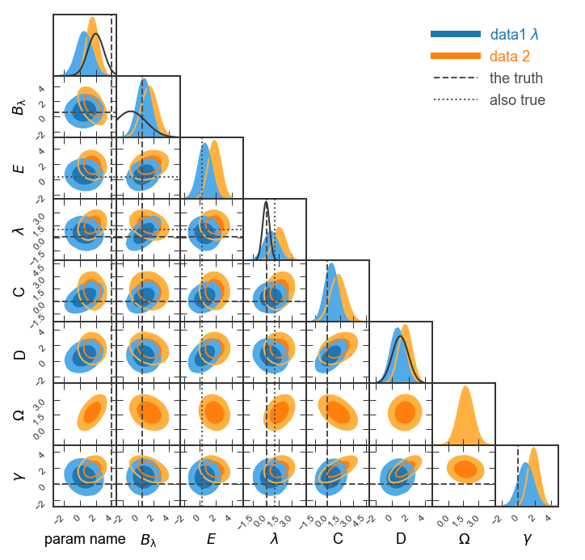
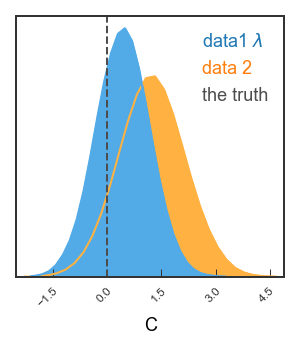

Example 1: Making a GTC/triangle plot with pygtc
================================================

This example is built from a jupyter notebook hosted on the `pyGTC
GitHub
repository <https://github.com/SebastianBocquet/pygtc/blob/master/demo.ipynb>`__.

Import dependencies
-------------------

.. code:: ipython3

    %matplotlib inline
    %config InlineBackend.figure_format = 'retina' # For mac users with Retina display
    from matplotlib import pyplot as plt
    import numpy as np
    import pygtc

Generate fake data
------------------

Let’s create two sets of fake sample points with 8 dimensions each. Note
that chains are allowed to have different lengths.

.. code:: ipython3

    # Create Npoints samples from random multivariate, nDim-dimensional Gaussian
    def create_random_samples(nDim, Npoints):
        means = np.random.rand(nDim)
        cov = .5 - np.random.rand(nDim**2).reshape((nDim,nDim))
        cov = np.triu(cov)
        cov += cov.T - np.diag(cov.diagonal())
        cov = np.dot(cov,cov)
        samples =  np.random.multivariate_normal(means, cov, Npoints)
        return samples
    
    # Create two sets of fake data with 8 parameters
    np.random.seed(0) # To be able to create the same fake data over and over again
    samples1 = create_random_samples(8, 50000)
    samples2 = 1+create_random_samples(8, 70000)

Omit one parameter for one chain
--------------------------------

Let’s assume the samples1 does not include the second to last parameter.
In the figure, we only want to show this parameter for samples2. pygtc
will omit parameters that only contain nan.

.. code:: ipython3

    samples1[:,6] = None

Minimal example
---------------

Note that numpy throws a ``RuntimeWarning`` because we set one of the
axes of ``samples1`` to ``None`` just above. As we understand the
warning, let’s move on!

.. code:: ipython3

    GTC = pygtc.plotGTC(chains=[samples1,samples2])

.. parsed-literal::

    pygtc/pygtc.py:558: RuntimeWarning: All-NaN axis encountered
      for k in range(nChains)]), axis=0)
    pygtc/pygtc.py:560: RuntimeWarning: All-NaN slice encountered
      for k in range(nChains)]), axis=0)

Complete the figure
-------------------

Now let’s add: \* axis and data labels \* lines marking some important
points in parameter space \* Gaussian distributions on the 1d histograms
that could indicate Gaussian priors we assumed

Note that all these must match number of parameters!

.. code:: ipython3

    # List of parameter names, supports latex
    # NOTE: For capital greek letters in latex mode, use \mathsf{}
    names = ['param name',
             '$B_\mathrm{\lambda}$',
             '$E$', '$\\lambda$', 
             'C',
             'D',
             '$\mathsf{\Omega}$',
             '$\\gamma$']
    
    # Labels for the different chains
    chainLabels = ["data1 $\lambda$",
                   "data 2"]
    
    # List of Gaussian curves to plot
    #(to represent priors): mean, width
    # Empty () or None if no prior to plot
    priors = ((2, 1),
              (-1, 2),
              (),
              (0, .4),
              None,
              (1,1),
              None,
              None)
    
    # List of truth values, to mark best-fit or input values
    # NOT a python array because of different lengths
    # Here we choose two sets of truth values
    truths = ((4, .5, None, .1, 0, None, None, 0),
              (None, None, .3, 1, None, None, None, None))
    
    # Labels for the different truths
    truthLabels = ( 'the truth',
                   'also true')
    
    # Do the magic
    GTC = pygtc.plotGTC(chains=[samples1,samples2],
                        paramNames=names,
                        chainLabels=chainLabels,
                        truths=truths,
                        truthLabels=truthLabels,
                        priors=priors)

Make figure publication ready
-----------------------------

-  See how the prior for :math:`B_{\lambda}` is cut off on the left?
   Let’s display :math:`B_\lambda` in the range (-5,4). Also, we could
   show a narrower range for :math:`\lambda` like (-3,3).
-  Given that we’re showing two sets of truth lines, let’s show the line
   styles in the legend (``legendMarker=True``).
-  Finally, let’s make the figure size publication ready for MNRAS.
   Given that we’re showing eight parameters, we’ll want to choose
   ``figureSize='MNRAS_page'`` and show a full page-width figure.
-  Save the figure as ``fullGTC.pdf`` and paste it into your
   publication!

.. code:: ipython3

    # List of parameter ranges to show,
    # empty () or None to let pyGTC decide
    paramRanges = (None,
                   (-5,4),
                   (),
                   (-3,3),
                   None,
                   None,
                   None,
                   None)
    
    # Do the magic
    GTC = pygtc.plotGTC(chains=[samples1,samples2],
                        paramNames=names,
                        chainLabels=chainLabels,
                        truths=truths,
                        truthLabels=truthLabels,
                        priors=priors,
                        paramRanges=paramRanges,
                        figureSize='MNRAS_page',
                        plotName='fullGTC.pdf')

Single 2d panel
---------------

See how the covariance between C and D is a ground-breaking result?
Let’s look in more detail! Here, we’ll want single-column figures.

.. code:: ipython3

    # Redefine priors and truths
    priors2d = (None,(1,1))
    truths2d = (0,None)
    
    # The 2d panel and the 1d histograms
    GTC = pygtc.plotGTC(chains=[samples1[:,4:6], samples2[:,4:6]],
                        paramNames=names[4:6],
                        chainLabels=chainLabels,
                        truths=truths2d,
                        truthLabels=truthLabels[0],
                        priors=priors2d,
                        figureSize='MNRAS_column')
    
    # Only the 2d panel
    Range2d = ((-3,5),(-3,7)) # To make sure there's enough space for the legend
    
    GTC = pygtc.plotGTC(chains=[samples1[:,4:6],samples2[:,4:6]],
                        paramNames=names[4:6],
                        chainLabels=chainLabels,
                        truths=truths2d,
                        truthLabels=truthLabels[0],
                        priors=priors2d,
                        paramRanges=Range2d,
                        figureSize='MNRAS_column',
                        do1dPlots=False)

Single 1d panel
---------------

Finally, let’s just plot the posterior on C

.. code:: ipython3

    # Bit tricky, but remember each data set needs shape of (Npoints, nDim)
    inputarr = [np.array([samples1[:,4]]).T,
                np.array([samples2[:,4]]).T]
    truth1d = [0.]
    GTC = pygtc.plotGTC(chains=inputarr,
                        paramNames=names[4],
                        chainLabels=chainLabels,
                        truths=truth1d,
                        truthLabels=truthLabels[0],
                        figureSize='MNRAS_column',
                        doOnly1dPlot=True)

