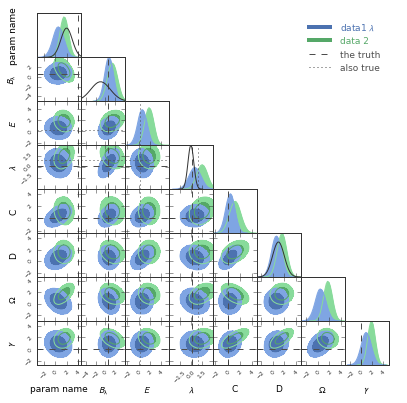

pygtc.py
========
Make a publication-ready giant-triangle-confusogram (GTC) with just one line of code!

This documentation is for the ``pygtc`` package, which is hosted at
`GitHub <https://github.com/SebastianBocquet/pygtc/issues>`_.

**What is a Giant Triangle Confusogram?**

A Giant-Triangle-Confusogram (GTC, aka triangle/corner plot) is a way of
displaying the results of a Monte-Carlo Markov Chain (MCMC) sampling or similar
analysis. The recovered parameter constraints are displayed on a grid in which
the diagonal shows the one-dimensional posteriors (and, optionally, priors) and
the lower-left triangle shows the pairwise projections. You might want to look
at a plot like this if you are fitting model to data and want to see the
parameter covariances along with the priors.

Although several other packages exists to make such a plot, we were unsatisfied
with the amount of extra work required to massage the result into something we
were happy to publish. With ``pygtc``, we hope to take that extra legwork out of
the equation by providing a package that gives a figure that is publication
ready on the first try!

Here's an example of a GTC (generated from some fake data, with some nonsensicle
labels):

**Note about contour levels**
In the above example, you see two sets of contour levels. These show the 68%
and 95% *confidence levels* (in addition, pygtc could also show the 99% confidence
level if you want). Note that these are indeed the 68% and 95% confidence levels,
and not Gaussian 1, 2, and 3 sigma levels (which, in two dimensions, correspond to
the 39%, 86%, and 99% confidence levels). Your posterior distributions will in
general not be Gaussian, and so we argue that there is no right or wrong in choosing
one or the other definition. We therefore recommend that you stick to the definition that is
commonly used in your field, and clearly state what quantities you are showing
in your figure caption. You can switch to displaying Gaussian sigma levels
by setting `GaussianConfLevels` to `True`.

Contents:
---------
.. toctree::
   :maxdepth: 2

   installation.rst
   demo.rst
   demo2.rst
   api.rst

Contributions, problems, questions, recommendations
---------------------------------------------------
Please report any problems or pitch new ideas on `GitHub <https://github.com/SebastianBocquet/pygtc/issues>`_ where pygtc is being developed. Bugs will be squashed ASAP and feature requests will be seriously considered.
