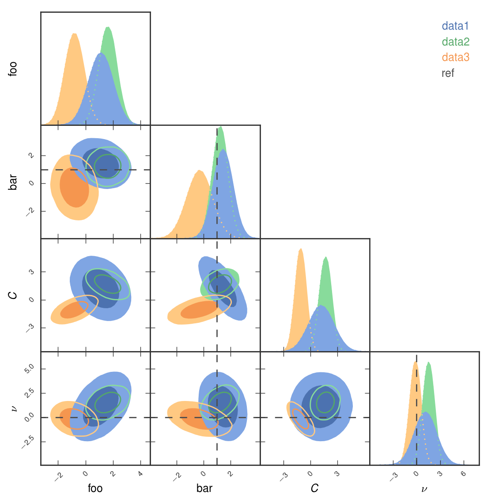

# Summary

Multi-dimensional model parameter spaces are commonly sampled using Markov Chain Monte-Carlo (MCMC) methods or more advanced algorithms as implemented, for instance, in `emcee` [@emcee] or `PyMultiNest` [@pymultinest]. The recovered parameter constraints are usually displayed on a grid in which the diagonal shows the 1-dimensional posteriors and the lower-left half shows the pairwise projections. Due to the triangular appearance, such plots are typically referred to as "triangle" or "corner" plots. If the parameter space is large, the resulting plot can be visually overwhelming; we refer to such a figure as a Giant Triangle Confusogram (GTC).

Several packages exist to produce these plots and range in functionality from the lightweight `corner` [@corner], which can display a single set of likelihood surfaces from a single analysis, to the feature-heavy `getdist` [@getdist], which allows arbitrary large data sets and contains nearly every conceivable option and customization (at the expense of a steep learning curve). `pygtc` aims to fill the parameter space in between by producing beautiful publication-ready figures with as little as a single line of code, while allowing for an arbitrary number of sets of likelihood surfaces (a crucial feature in our field of cosmology). Various user-friendly options allow for further adjustments and ensure that details such as font sizes are chosen to match the layout of several astrophysical journals.

Figure 1 shows an example figure (comparing three sets of data from different analyses) that was produced with the `pygtc` package and formatted for the Astrophysical Journal, all with the following line of code:

```python
GTC = pygtc.plotGTC(chains=[dat1,dat2,dat3],
                    chainLabels=["data1", "data2", "data3"],
                    paramNames=['foo', 'bar', '$C$', '$\\nu$'],
                    truths=(None, 1, None, 0),
                    truthLabels='ref',
                    figureSize='APJ_page')
```



`pygtc` relies on `matplotlib` [@matplotlib] and `scipy` [@scipy] to produce aesthetically appealing GTCs, and is designed to accept the standard output of the `emcee` package or any other likelihood sampler that returns a list of (weighted or unit-weighted) sample points. The source code for `pygtc` is available at Zenodo [@pygtc_zenodo] and development is ongoing at GitHub [@pygtc].

# References
